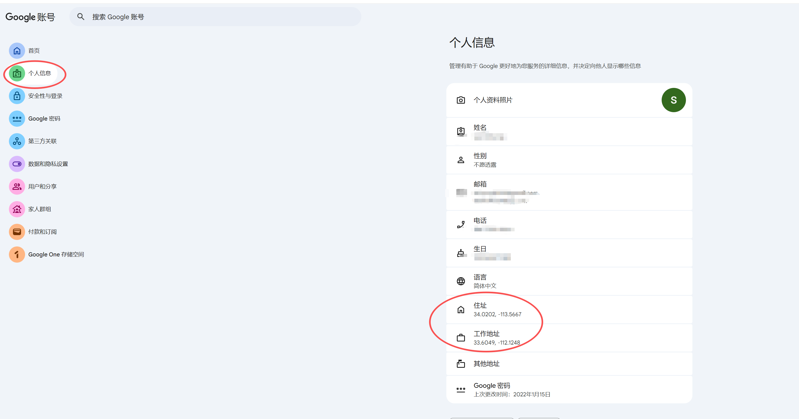
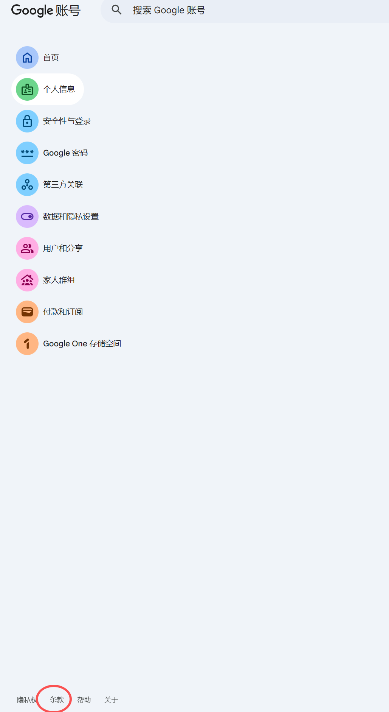
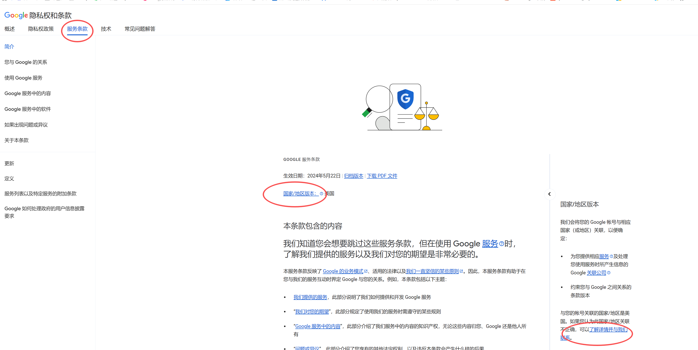
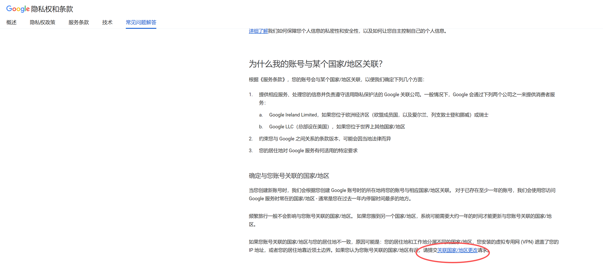
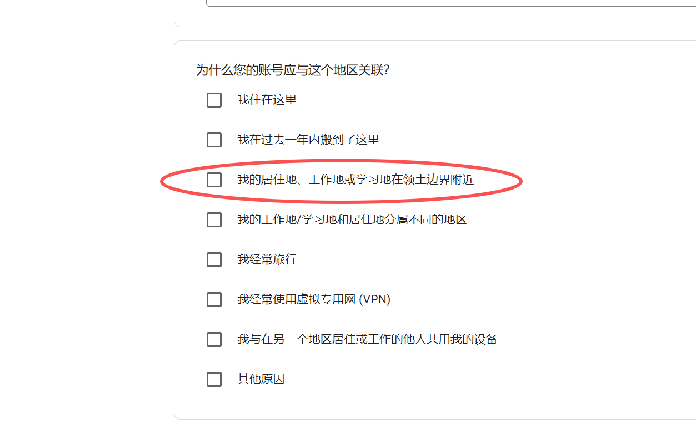

# How to Change Your Google Account Region

# 如何更改谷歌账号地区

`#Tutorial` `#Google`

**Date / 日期**: 2026-02-11

---

## Overview / 概述

This guide walks you through changing your Google Account region to the United States. This can be useful when you need to access region-locked Google services or content.

本文分享如何将谷歌账号地区更改为美国。当你需要访问受地区限制的 Google 服务或内容时，这个教程会对你有所帮助。

---

## Prerequisites / 前提条件

- A VPN connection with a **US IP address** / 一个能连接美国 IP 的 VPN
- A Google account / 一个谷歌账号

---

## Step-by-Step Guide / 操作步骤

### Step 1: Set Your Home and Work Address / 设置住址和工作地址

Open your Google Account, navigate to **Personal Info**, and find the **Home and work addresses** section. Set your address based on the location shown on the map.

打开谷歌账号，进入 **个人信息** 页面，找到 **住址和工作地址** 设置项。根据地图上显示的定位来选择对应地址。

---

### Step 2: Open the Terms Page / 打开条款页面

Scroll to the bottom of your Google Account page and find the **Terms** section.

在谷歌账号页面底部，找到 **条款** 相关链接。

---

### Step 3: Navigate to Region Change Page / 跳转到地区更改页面

Click the marked link on the Terms page to navigate to the **region change** page.

点击条款页面上标记的链接，跳转到 **地区更改** 页面。

---

### Step 4: Select Your New Region / 选择新的地区

On the region change page, select the target region (United States).

在地区更改页面中，选择目标地区（美国）。

---

### Step 5: Fill in the Reason / 填写更改理由

Enter a reason for the region change and submit your request.

填写更改地区的理由，然后提交申请。

---

## Important Notes / 注意事项

> **Key Point / 要点**:
>
> 1. **VPN Region Must Match / VPN 地区必须一致**
>    - Ensure your VPN is connected to a **US server** before starting.
>    - 确保 VPN 连接的是 **美国节点**。
>
> 2. **Address Must Be Consistent / 地址必须保持一致**
>    - Your work address should match the IP location of your VPN.
>    - 工作地址应与 VPN 所定位的 IP 地址保持一致。
>
> 3. **Match the Correct State / 匹配正确的州**
>    - Check the map to identify which US state your VPN IP maps to, and fill in the corresponding state when changing the region.
>    - 在地图上确认 VPN IP 对应的是美国哪个州，更改地区时填写对应的州名。

---

*Author: AlexByYao*
